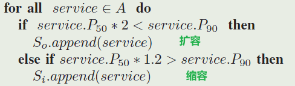

1. Adaptive scaling of Kubernetes pods
HPA+VPA 控制循环

2. Key influencing factors of the Kubernetes auto-scaler for computing-intensive microservice-native cloud-based applications

    指出影响扩缩容效率的因素：
    - 固定的扩缩容目标阈值，提出可以添加一些常数，使扩缩容阈值变为一个区间
    - 扩缩容触发间隔

3. Smart HPA: A Resource-Efficient Horizontal Pod Auto-scaler for Microservice Architectures
   - 采用资源转移启发式算法，动态改变微服务副本上限和微服务副本期望数量
   - 资源转移算法适配任何扩缩容算法
   - 集中-分散架构，每个微服务都配有一个HPA，**利于减少集中式HPA的通信交互**。集中资源管理器用于资源转移，**减少资源浪费，提高服务性能**
   - 以插件形式运行

4. Microscaler: Automatic Scaling for Microservices with an Online Learning Approach
   
    创新：
    - 改变已有的autoscaler使用资源相关指标和负载相关指标作为缩放启动指标的方式，使用延时p90
    - 使用导致应用性能下降的关键微服务定位技术
    
    结构
    - sla违规检测 + 关键微服务定位  + 扩缩容
    - sla违规检测：p90
    - 关键微服务定位：

        
    - 扩缩容：贝叶斯优化

5. PBScaler: A Bottleneck-Aware Autoscaling Framework for Microservice-Based Applications

   - 改进Microscaler
   - sla违规检测 + 关键微服务定位 + sla违规预测 + 扩缩容
   - sla违规检测：P90 < slo * (1 + a)
   - 关键微服务定位：toporank = topo potential thery + personal page rank，ppr的转移矩阵系数是 Pij = max(当前节点的p90延迟, 下游节点的所有metric)
   - sla违规预测：二分决策树，输入特征（qps,pod_count）
   - 扩缩容：GA，，fitness函数考虑**是否有slo违规以及资源消耗**，**减少扩缩容过程中的副本数波动**
   - 以外部进程的方式，调用prometheus 和 k8s 的api干预扩缩容

6. Auto-scaling techniques in container-based cloud and edge/fog computing: Taxonomy and survey 
   
   边-云 扩缩容 综述

7. Horizontal Pod Autoscaling in Kubernetes for Elastic Container Orchestration

    HPA的改进点列举

8. KOSMOS : Vertical and Horizontal Resource Autoscaling for Kubernetes

   -  vpa+hpa同时存在
   -  避免传统vpa需要杀死pod再重启的方式，使用k8s的一个新的功能（目前已删除）
   -  vpa对同一个微服务的不同pod执行不同的资源分配，使用控制理论获取新的资源上限
   -  采用资源感知的负载均衡

9. DScaler: A Horizontal Autoscaler of Microservice Based on Deep Reinforcement Learning

    - DQN决策扩缩容的副本数
    - state:(平均cpu利用率，副本数，请求率)
    - action:(-2,-1,0,1,2)
    - reward:util+penalty(if has slo voilation)
    - 优化资源利用率和响应时延

# Rule based

# queue theroy based

# ML based

# challenge

1. predictive method 的决策精度取决于预测算法，该算法受历史工作负载数据中的异常、缺失值和错误的影响，无法处理意外工作负载
2. proactive method 方法受到工作负载波动的严重影响，导致服务资源的频繁无效缩放。此外，由于缩放时间的存在，不同缩放动作的完成延迟不同
3. 目前的方法忽略了多类型服务的混合缩放的不同缩放时间，包括有状态服务和无状态服务。特别是，当有状态服务水平缩放时，忽略的长缩放时间会导致资源的不及时供应和退出

# 想法

针对多个不同类型的服务，采用模型预测其缩放时间

每个边缘节点有自己的HPA控制器，这里称为EHPA，这样减少

每n个边缘节点组成一个自治区，自治区内的节点会动态变动，每隔一段时间进行重新划分：
1. 节点退出：当节点宕机或与自治区其他节点网络不通时，自动退出（可以是每个节点有一个检测机制，也可以是自治区自己有自己的检测机制）
2. 节点加入

服务扩缩容后的副本只会运行在自治区内

--- 
针对边缘端资源受限的缺陷，是否可以有一种方式，对边缘端各服务的资源limit和request进行动态调整，只有在实在无法调整时，启动HPA

---
边缘节点的分布导致了流量转发或请求负载均衡（默认的负载均衡）时，会把请求分配到其他节点，而没有考虑边缘节点之间的物理距离